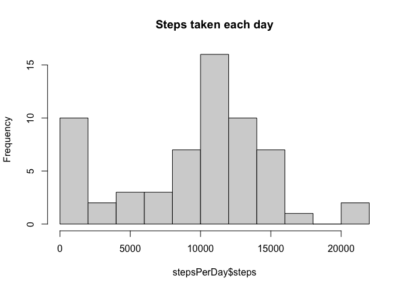
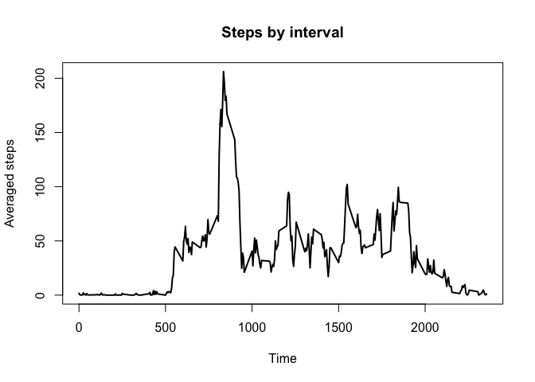
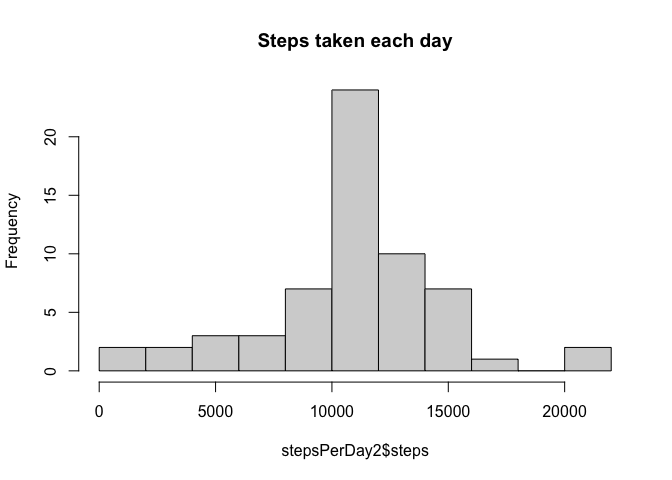
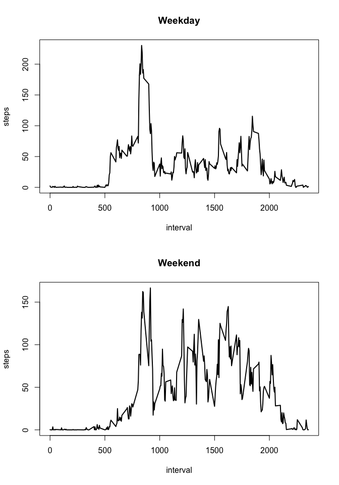

## Loading and preprocessing the data

Unzip the activity file and read it in. 

Take a look at the data format.


```r
unzip("activity.zip")
activity <- read.csv("activity.csv")
head(activity, 4)
```

```
##   steps       date interval
## 1    NA 2012-10-01        0
## 2    NA 2012-10-01        5
## 3    NA 2012-10-01       10
## 4    NA 2012-10-01       15
```

Convert the date column into date type. And that's all data processing needed for now.


```r
activity$date <- as.Date(activity$date, "%Y-%m-%d")
summary(activity)
```

```
##      steps             date               interval     
##  Min.   :  0.00   Min.   :2012-10-01   Min.   :   0.0  
##  1st Qu.:  0.00   1st Qu.:2012-10-16   1st Qu.: 588.8  
##  Median :  0.00   Median :2012-10-31   Median :1177.5  
##  Mean   : 37.38   Mean   :2012-10-31   Mean   :1177.5  
##  3rd Qu.: 12.00   3rd Qu.:2012-11-15   3rd Qu.:1766.2  
##  Max.   :806.00   Max.   :2012-11-30   Max.   :2355.0  
##  NA's   :2304
```

## What is mean total number of steps taken per day?

Compute the total umber of steps for each day, and make a histogram.


```r
stepsPerDay <- with(activity, aggregate(steps, by = list(date), 
                    FUN = sum, na.rm = T))
names(stepsPerDay) <- c('date', 'steps')
hist(stepsPerDay$steps, breaks = 10, main = "Steps taken each day")
```

<!-- -->

Summarize the steps-by-day data, we can see mean equals 9354 and median equals 10395.


```r
summary(stepsPerDay$steps)
```

```
##    Min. 1st Qu.  Median    Mean 3rd Qu.    Max. 
##       0    6778   10395    9354   12811   21194
```

## What is the average daily activity pattern?

Compute number of steps for each interval, averaged across days. Make a time series plot to show how steps change at different times in a day.


```r
stepsByInterval <- with(activity, aggregate(steps, by = list(interval), 
                        FUN = mean, na.rm = T))
names(stepsByInterval) <- c('interval', 'steps')
with(stepsByInterval, plot(interval, steps, type = 'l', lwd = 2, 
        main = 'Steps by interval', xlab = 'Time', ylab = 'Averaged steps'))
```

<!-- -->

Which interval contains the maximum number of steps? 

835, apparently.


```r
stepsByInterval[stepsByInterval$steps == max(stepsByInterval$steps), ]
```

```
##     interval    steps
## 104      835 206.1698
```

## Imputing missing values

How many NAs there are in the original dataset?


```r
sum(is.na(activity$steps))
```

```
## [1] 2304
```

We can use mean of corresponding interval to fill those NAs.

And we should not just modify the original data.


```r
activity2 <- activity
activity2$averagedSteps <- rep(stepsByInterval$steps, 61)
naidx <- is.na(activity$steps)
activity2[naidx, "steps"] = activity2[naidx, "averagedSteps"]
summary(activity2)
```

```
##      steps             date               interval      averagedSteps    
##  Min.   :  0.00   Min.   :2012-10-01   Min.   :   0.0   Min.   :  0.000  
##  1st Qu.:  0.00   1st Qu.:2012-10-16   1st Qu.: 588.8   1st Qu.:  2.486  
##  Median :  0.00   Median :2012-10-31   Median :1177.5   Median : 34.113  
##  Mean   : 37.38   Mean   :2012-10-31   Mean   :1177.5   Mean   : 37.383  
##  3rd Qu.: 27.00   3rd Qu.:2012-11-15   3rd Qu.:1766.2   3rd Qu.: 52.835  
##  Max.   :806.00   Max.   :2012-11-30   Max.   :2355.0   Max.   :206.170
```

Now use this new dataset to calculate total number of steps taken per day.


```r
stepsPerDay2 <- with(activity2, aggregate(steps, by = list(date), FUN = sum))
names(stepsPerDay2) <- c('date', 'steps')
hist(stepsPerDay2$steps, breaks = 10, main = "Steps taken each day")
```

<!-- -->

And let's see the mean and median are both 10766 now.


```r
summary(stepsPerDay2$steps)
```

```
##    Min. 1st Qu.  Median    Mean 3rd Qu.    Max. 
##      41    9819   10766   10766   12811   21194
```

We can see that both mean and median are higher than the original data. And the distribution of the number of steps is more centered.

## Are there differences in activity patterns between weekdays and weekends?

Create a new factor variable with two levels – “weekday” and “weekend” indicating whether a given date is a weekday or weekend day.


```r
activity2$weekday <- weekdays(activity2$date, abbreviate = T)
activity2$weekday <- activity2$weekday %in% c('六', '日')    #this should change accoring to which region you are at.
activity2$weekday <- factor(activity2$weekday, levels = c("FALSE", "TRUE"), 
                            labels = c("weekday", "weekend"))
```

Now create a panel plot containing a time series plot of the 5-minute interval and the average number of steps taken, averaged across all weekday days or weekend days.


```r
weekdayAverage <- with(activity2[activity2$weekday == 'weekday', ], 
                       aggregate(steps, by = list(interval), mean))
names(weekdayAverage) <- c('interval', 'steps')
weekendAverage <- with(activity2[activity2$weekday == 'weekend', ], 
                       aggregate(steps, by = list(interval), mean))
names(weekendAverage) <- c('interval', 'steps')

par(mfrow = c(2, 1))
with(weekdayAverage, plot(interval, steps, type = 'l', lwd = 2, main = 'Weekday'))
with(weekendAverage, plot(interval, steps, type = 'l', lwd = 2, main = 'Weekend'))
```

<!-- -->

We can see that the subject is indeed more active (taking more steps) in weekends than in weekdays.
